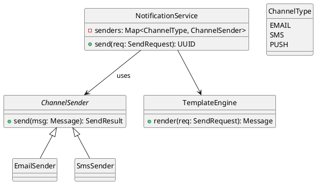
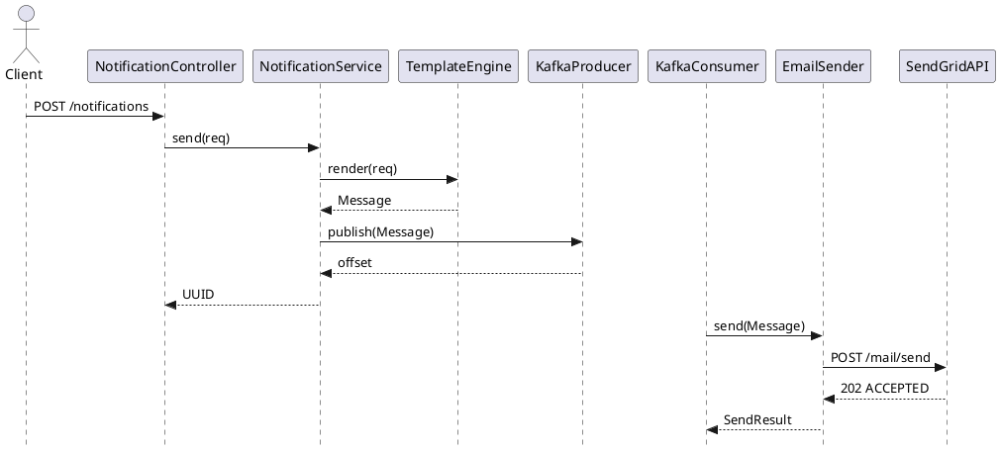

# Notification Service

# Notification System – Buy vs Build Analysis & End‑to‑End Design (Java + Spring Boot, 2025)

---

## 1. Introduction
A Notification System is a critical backbone service for any product, enabling engagement, alerts, and system transparency. The system designed here supports multi-channel delivery (email, SMS, push), dynamic templating, retries, and user preferences.

---
## 2. Buy vs Build Decision

| Aspect                | Buy (e.g., SendGrid, Twilio Notify) | Build In-House |
|----------------------|--------------------------------------|----------------|
| Cost (Scale)         | $$$ – per message, expensive at scale | One-time effort + infra |
| Customization        | Limited                             | Full control |
| Vendor Lock-in       | Yes                                 | No |
| Observability        | Limited                             | Full (logs, metrics) |
| Retry + DLQ          | Basic                               | Customizable |
| Compliance (DND etc) | Varies by vendor                    | You control |
| Time-to-Market       | Fast                                | Slower |

**✅ Decision**: *Build* – due to need for extensibility, vendor-agnostic routing, and product alignment.

---
## 3. Key Functional Requirements
- Send notifications via Email, SMS, Push
- Channel fallback (Email → SMS)
- Template engine with variables
- Store audit history
- Retry failed sends
- Multi-tenant & language support

---
## 4. Tech Stack
- **Java 17**
- **Spring Boot 3.3+**
- Kafka (as async message backbone)
- PostgreSQL / MongoDB (audit + templates)
- Redis (for idempotency + caching templates)

---
## 5. Modules (Multi-Module Maven Structure)
- `notification-api` – REST interface for requests
- `notification-core` – business logic abstractions (e.g., `ChannelSender`, `Message`)
- `channel-email-service` – concrete email sender
- `channel-sms-service` – SMS sender (e.g., Twilio)
- `template-service` – Renders templates
- `common-libs` – shared POJOs, error handling

---
## 6. Core Domain Models

### SendRequest
```java
public record SendRequest(
    String templateCode,
    String userId,
    ChannelType preferredChannel,
    Map<String, String> variables
) {}
```

### Message
```java
public record Message(
    UUID id,
    ChannelType channel,
    String to,
    String body,
    Map<String, String> headers
) {}
```

### SendResult
```java
public record SendResult(
    UUID messageId,
    boolean success,
    String details
) {}
```

---
## 7. Core Interface
```java
public interface ChannelSender {
    SendResult send(Message message);
}
```

---
## 8. NotificationService (Core Service)
```java
@Service
public class NotificationService {
    private final TemplateEngine templateEngine;
    private final Map<ChannelType, ChannelSender> senders;

    public UUID send(SendRequest request) {
        Message message = templateEngine.render(request);
        ChannelSender sender = senders.get(request.preferredChannel());
        SendResult result = sender.send(message);
        return result.messageId();
    }
}
```

---
## 9. TemplateEngine
```java
@Component
public class TemplateEngine {
    public Message render(SendRequest req) {
        // Load template by code, inject variables, construct Message
    }
}
```

---
## 10. Spring Boot Multi-Module Setup
### Parent POM (`notification-parent/pom.xml`)
```xml
<project>
  <modules>
    <module>notification-core</module>
    <module>notification-api</module>
    <module>channel-email-service</module>
    <module>channel-sms-service</module>
    <module>template-service</module>
    <module>common-libs</module>
  </modules>
  <properties>
    <java.version>17</java.version>
    <spring.boot.version>3.3.0</spring.boot.version>
  </properties>
  <dependencyManagement>
    <dependencies>
      <dependency>
        <groupId>org.springframework.boot</groupId>
        <artifactId>spring-boot-dependencies</artifactId>
        <version>${spring.boot.version}</version>
        <type>pom</type>
        <scope>import</scope>
      </dependency>
    </dependencies>
  </dependencyManagement>
  <build>
    <plugins>
      <plugin>
        <groupId>org.apache.maven.plugins</groupId>
        <artifactId>maven-compiler-plugin</artifactId>
        <version>3.11.0</version>
        <configuration>
          <release>17</release>
        </configuration>
      </plugin>
      <plugin>
        <groupId>org.springframework.boot</groupId>
        <artifactId>spring-boot-maven-plugin</artifactId>
      </plugin>
    </plugins>
  </build>
</project>
```

---
## 11. Git & GitHub Setup
```bash
cd notification-service
cat > .gitignore <<EOF
/target/
.idea/
.vscode/
*.log
.DS_Store
EOF

git init
git add .
git commit -m "Initial commit"
git remote add origin https://github.com/<your-user>/notification-service.git
git push -u origin main
```

---
## 12. UML & Sequence Diagrams (PlantUML)

> You can paste these blocks into [PlantUML Live](https://www.planttext.com/) or IntelliJ IDEA UML plugin.

### 12.1 Class Diagram (Core Abstractions)


### 12.2 Sequence Diagram – "Send Email"


Feel free to generate PNG/SVG from these diagrams and embed them in docs or READMEs.


# Class Diagram


Add Class diagram generation template
@startuml
skinparam style strictuml

interface ChannelSender {
  +send(msg: Message): SendResult
}

class NotificationService {
  -senders: Map<ChannelType, ChannelSender>
  +send(req: SendRequest): UUID
}

class TemplateEngine {
  +render(req: SendRequest): Message
}

enum ChannelType {
  EMAIL
  SMS
  PUSH
}

NotificationService --> ChannelSender : uses
NotificationService --> TemplateEngine
ChannelSender <|-- EmailSender
ChannelSender <|-- SmsSender
@enduml


# Sequence Diagram


Sequence Diagram generation Template

@startuml
skinparam style strictuml
actor Client
Client -> NotificationController: POST /notifications
NotificationController -> NotificationService: send(req)
NotificationService -> TemplateEngine: render(req)
TemplateEngine --> NotificationService: Message
NotificationService -> KafkaProducer: publish(Message)
KafkaProducer --> NotificationService: offset
NotificationService --> NotificationController: UUID

KafkaConsumer -> EmailSender: send(Message)
EmailSender -> SendGridAPI: POST /mail/send
SendGridAPI --> EmailSender: 202 ACCEPTED
EmailSender --> KafkaConsumer: SendResult
@enduml


# Sequence Diagram - Retry


@startuml
skinparam style strictuml

actor KafkaConsumer
KafkaConsumer -> SmsSender: send(Message)
SmsSender -> TwilioAPI: POST /messages
TwilioAPI --> SmsSender: 500 SERVER ERROR
SmsSender --> KafkaConsumer: throw RetryableException

KafkaConsumer -> Kafka: re-publish to retry topic (e.g., notify-SMS-retry)
Kafka -> KafkaConsumer: re-deliver after backoff

note right of KafkaConsumer
  Uses exponential backoff.
  After N failures, send to DLQ.
end note
@enduml

# Sequence Diagram - Template Version Resolution


@startuml
skinparam style strictuml

actor NotificationService
NotificationService -> TemplateEngine: render(req)
TemplateEngine -> TemplateRepository: findByCodeAndLocale("WELCOME", "en")
TemplateRepository --> TemplateEngine: Template(v3)
TemplateEngine --> NotificationService: Rendered Message
@enduml


# Sequence - User Preference Check


@startuml
skinparam style strictuml

actor NotificationController
NotificationController -> NotificationService: send(req)
NotificationService -> PreferenceService: getPreferences(userId)
PreferenceService --> NotificationService: Preferences{ email: false }

alt email disabled
  NotificationService --> NotificationController: skip (not allowed)
else email enabled
  NotificationService -> TemplateEngine: render(req)
  ...
end
@enduml

